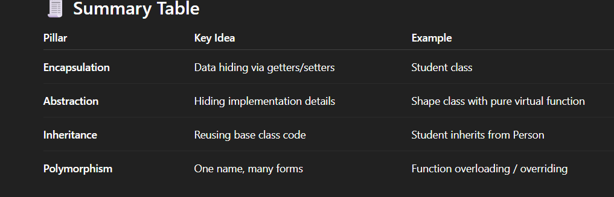

What is OOPs?

OOP (Object-Oriented Programming) is a programming paradigm based on the concept of objects — which contain data (attributes) and functions (methods) that operate on that data.

It helps make code:
1. More organized
2. Reusable
3. Easier to maintain and debug

Pillar	Description	Keyword/Concept
1. Encapsulation	Wrapping data and methods into a single unit (class)	private, public
2. Abstraction	Showing only essential features and hiding the background details	abstract class, pure virtual function
3. Inheritance	Deriving a new class from an existing one	: operator
4. Polymorphism	Same function behaves differently based on context	function overriding, function overloading

